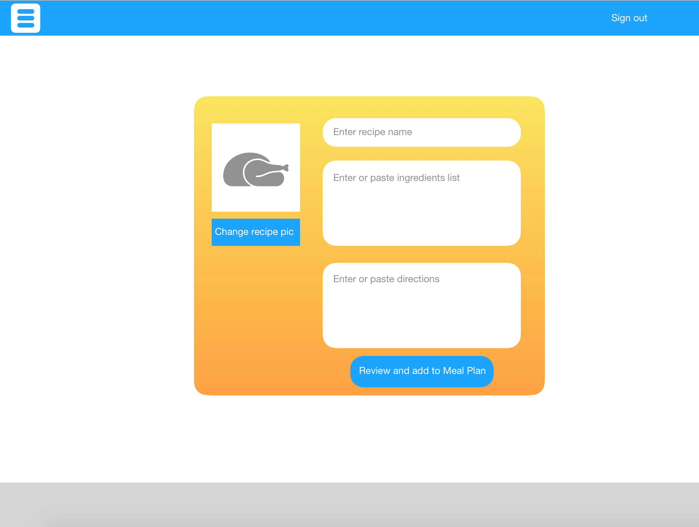

# FoodRun

Having a plan when running to the store.

Making food at home saves money, but in order to make sure you use it all up, it
helps to have a plan.

This app, built with a Rails API and a JavaScript front end, is a simple recipe
keeper. With a later update, it will have the ability to produce a grocery list
from the recipes you choose for the week.

# Planning

I initially wanted this app to be complete with a list generator along with check-marking capability on the list. As part of planning the basic requirements of this type of app, I determined the first feature to develop a simple one-to-many data relationship would be a recipe keeper. So I planned to build a working version of this simpler feature, and add to that.

I used this image as a design wireframe:

I used these user stories to inform design:

Version 1
As a user, I want to create an account
- As a user, I want to save recipes to a library

Version 2
- As a user, I want to add recipes to a shopping list/weekly meal plan that generates a shopping list
 - this means that a plan will have to pull ingredients and amounts from recipes
- As a user, I want to edit the ingredients and amounts on my shopping list
 - edit in these two ways:
   - move an ingredient and its amount to a section showing I already have it
   - cross off items when bought, but retain a record of what I bought (still show it visually)

# Link to the back end repo:

https://github.com/fritzable/food-run

# Link to deployed sites:

Client: https://fritzable.github.io/food-run-client/
API: https://logansfoodrun.herokuapp.com/

# What it does and how it works

Users can sign in and add their own recipes.
Using Rails' authentication methods, all Users are subject to password and username validation before accessing the site's functions.
Signed in Users can retrieve the list of their own recipes, or view a single recipe (currently by ID reference only, updates should include search functionality). Users can update their recipes individually, and they can change their user password.
Recipes and any changes are saved as resources to a Postgresql database (Users are, as well).
JavaScript: UI and API interaction logic
HTML: structure
CSS: styling
Bootstrap: styling
Handlebars: HTML DOM updating

# Later version enhancements

This app led to several ideas about other cooking-related pain points, and a few of them could be incorporated into later versions of FoodRun.

Optimize step-by-step instruction reading for small devices:
I would say recipe instructions have yet to be optimized on any digital platform, whether laptop or mobile. There is an opportunity to make cooking apps more useful. Steps should be large and readable, and easy to step through. I see this as being an extra large "current" step, with smaller "prior" and "next" steps rotating positions with "current."

### Deployment
Be deployed online, where the rest of the world can access it.
1.  [x]  Host on your public Github page, not Github Enterprise.
1.  [x]  Deploy client application on GH pages.
1.  [x]  Deploy server application on Heroku.

### Version Control
Demonstrate using version control by:
1.  [x]  Sharing your work through a git repository hosted on Github.
1.  [x]  Making frequent, cohesive commits dating back to the **first day**
of the project week.
1.  [x]  1 commit on the first day of project week on both repos.
1.  [x]  At least 1 commit every day during project week (not necessarily on both repos).

### Documentation
Produce documentation in the form of a **README**, which must:
1.  [x] Create 2 Github repos (one for your front-end and one for your back-end)
1.  [x] Pin both repositories on GitHub as a Popular Repository
1.  [x] Each repo will need a README.md file with a link to the other repo and an explanation of the what the app does and how it works.
1.  [x] Each repo must contain the link to both deployed sites
1.  [x] Complete the repository `Description` field and `Website` field with a meaningful sentence description of the application and link to the live URL

1.  [x] List technologies used
1.  [x] List unsolved problems which would be fixed in future iterations.
1.  [x] Document your planning and tell a story about your development process and problem-solving strategy.

Your front-end repo's README should also have
1.  [x] Link to wireframes and user stories.

Your back-end repo's README should also have
1.  [x] Link to Entity Relationship Diagram (ERD).

### Auth Specifications
1.  [x]  Signup with email, password, and password confirmation.
1.  [x]  Login with email and password.
1.  [x]  Logout when logged in.
1.  [x]  Change password with current and new password.
1.  [x]  Signup and Signin must only be available to not signed in users.
1.  [x]  Logout and Change password must only be available to signed in users.
1.  [x]  Give feedback to the user after each action's success or failure.
1.  [x]  All forms must clear after submit success or failure

### Client Specifications
1.  [x]  Use a front-end Javascript app to communicate with your API (both read and write) and render data that it receives in the browser.
1.  [x]  Have semantically clean HTML and CSS
1.  [x] User must be able to create a new resource
1.  [x] User must be able to update a resource
1.  [x] User must be able to delete a resource
1.  [x] User must be able to view a single or multiple resource(s)
1.  [x] All resource actions must only be available to a signed in user.
1.  [x] Give feedback to the user after each action's success or failure.
1.  [x] All forms must clear after submit success or failure

### API Specifications
1.  [x]  Build an API using Ruby on Rails and Postgresql.
1.  [x]  Create at least 4 RESTful routes for handling GET, POST, PUT/PATCH, and DELETE requests.
1.  [x]  Any actions which change data must be authenticated and the data must be "owned" by the user performing the change.
1.  [x]  Have at least 1 resource that has a relationship to User

### DO NOT!!
Your app **must not**:
1.  [ ]   Delete your repository at any time or start over.
1.  [ ]   Rely on refreshing the page for any functionality.
1.  [ ]   Have any user-facing bugs.
    - [ ] Display non-functional buttons, nor buttons that do not successfully complete a task.
    - [ ] Show actions at inappropriate times (example:  change password form when a user is not signed in).
    - [ ] Forms not clearing at appropriate times (example: sign up form not clearing after success).
1.  [ ]   Use alerts for anything.
1.  [ ]   Display errors or warnings in the console.
1.  [ ]   Display debugging messages in the console.
